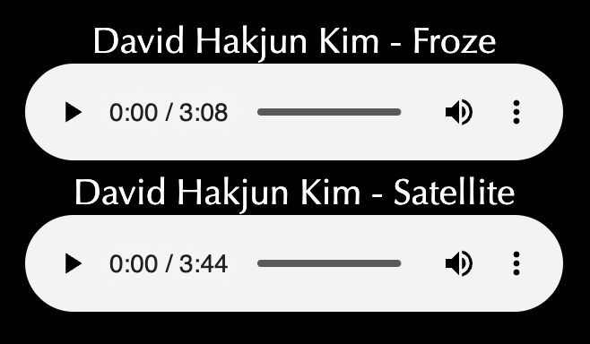
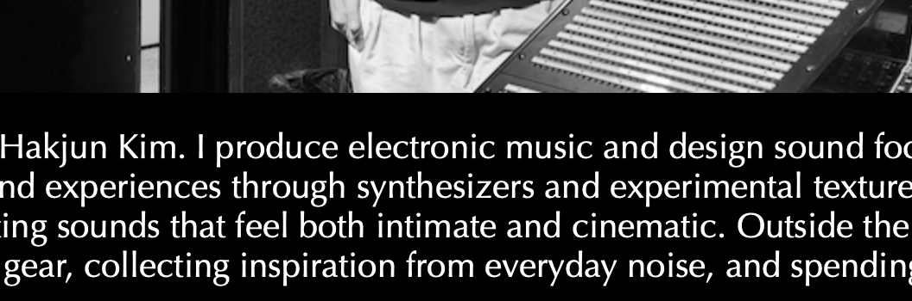
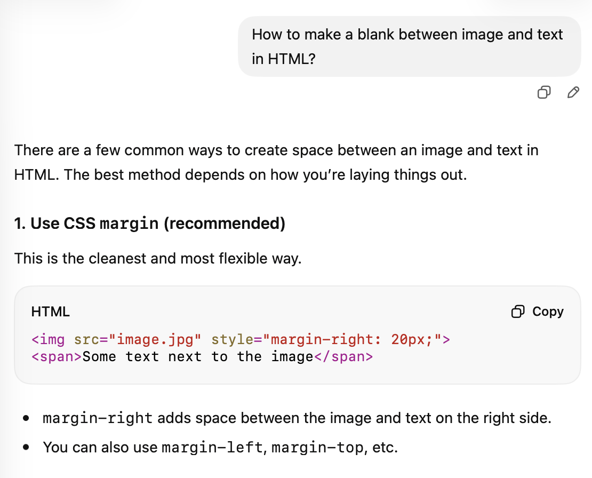

# Final Project

Through this final project, I created my own portfolio website.

***

# In this Project...

## Introduction

I attached my photo and introduction.

***

## My Works

```css
<audio src="~" controls>
	```
	
I introduced my song and made it possible to play the audio using the "audio src="Froze.mp3" controls" function along with the title.

***

## Contacts

```css
    <p>Instagram <a href="https://www.instagram.com/davidkimmusic"> davidkimmusic </a> 
</p>
    <p>E-mail <a href="mailto:hkim95@berklee.edu">hkim95@berklee.edu</a> 
</p>
```

I added a 'contacts' section. In this section, I enabled access to Instagram and email using the hyperlink feature "a href". Interestingly, the properties of each hyperlink are different. Unlike the link leading to the Instagram address, clicking the link containing email information directs you to a page where you can send an email. Here, I learned about a feature called "mailto" through an internet search. This feature recognizes the entered email address as the recipient and generates an address (in a new window) to send the email.

***

## Difficulties encountered while working on this project


from

```css
h1 {
  color: white;
  text-align: center;
}
```

to

```css
h1 {
  font-family: "Optima";
  color: white;
  text-align: center;
}
```

## 1. I wanted to apply the "Optima" font, but I didn't know how. 

The font was applied to the header and body of the text, but I was confused because it was different elsewhere. It turned out to be an easily solved problem; I just needed to specify the font for each element within the CSS file.

***



```css
  
  ```
  
  So I added "style="margin-bottom: 20px;"
  

  
```css
  
    ```

## 2. I wanted to put a blank space between the image and the text.



Having the image and text right below to each other didn't feel aesthetically pleasing. So, I tried to separate them by creating space in the middle using the backspace key, but it didn't work. I asked ChatGPT, and they provided additional code: "style="margin-right: 20px;". I added this to the CSS, but it still didn't work. I realized that since I needed space below the image, I should have changed "right" to "bottom", and consequently, the full meaning of the code was to create a 20px margin at the bottom.

***

## Through this project...

I was able to create my portfolio website using HTML and CSS. At first, building a website felt incredibly difficult, but as I continued, I found it enjoyable to shape it in my own style, and it began to feel like a form of art. I want to study programming further so that I can apply it not only to website creation but also to various aspects of my work.
